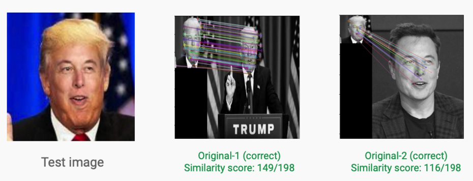
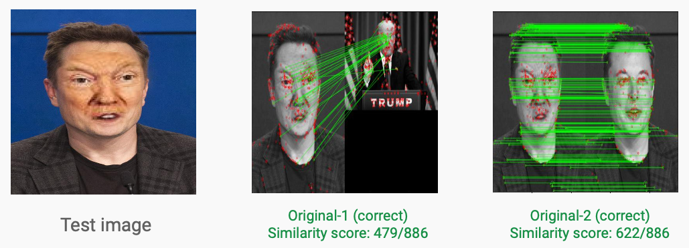

# Profile Cloning Detection
## How to run
The machine should satisfy the following requirements:
- Machine should have python3 installed.
- Use the following command to download all the required libraries. 
```go
pip install -r requirements.txt
```
- The external libraries required are as follows:
  - numpy
  - cv2
  - matplotlib
  - mtcnn (optional, required for face extraction) 

- For running the code, follow the command format as: `python3 Methods/method1.py <relative_path_to_image1> <relative_path_to_image2>`. 
- For example, if we want to compare images/musk0.jpg and images/musk1.jpg, we will give the command as follows: 
 ``` go
 python3 Methods/method1.py images/musk0.jpg images/musk1.jpg
 ```
- Similar commands is used for method2 and method3 as well.

## Directory Layout

```go
 ShareACab
   +--- README // Basic information
   +--- requirements  // Contains all external libraries used
   +--- FaceSwap-Master
        +--- imgs // Contains various input and output images.
        +--- face_swap.py // Code to generate face swap images.
        +--- requirements.txt // Contains all external libraires used in FaceSwap-Master
   +--- Methods
        +--- all_method.py // All the 3 methods combined in 1 (useful in comparing the 3 methods).
        +--- method1. py // Code implementation of Algorithm-1.
        +--- method2. py // Code implementation of Algorithm-2.
        +--- method3. py // Code implementation of Algorithm-3.
   +--- Testing Code
        +--- method1_testing.py // Code to test method1 on 300 images.
        +--- method2_testing.py // Code to test method2 on 300 images.
   +--- images // Contains all the images used for basic running of code.
   +--- output // Contains all the output images/screenshots to be displayed in this README.
   +--- report: update // Contains the weekly work report. Contains some important paper links and other relevant information.
   +--- face_extraction.py and single_face_ext.py // The code for extracting face out of any image. Might be useful for pre-processing sometimes.
```

# Results
 </br> </br>  </br> </br> 
 </br> </br>  </br> </br> 
 </br> </br>  </br> </br> 
 </br> </br>  </br> </br> 
 </br> </br>  </br> </br> 
 </br> </br>  </br> </br> 
